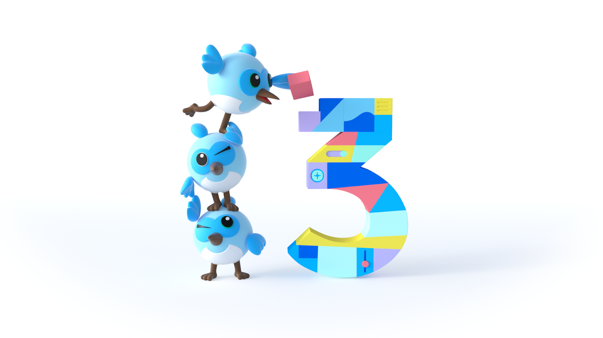

# flutter_travel

A new Flutter project, Version `3.0.1` is used.

<div align="center">

</div>

```
$ /flutter
$ /flutter/bin/cache/dart-sdk
Flutter 3.0.1 • channel stable • https://github.com/flutter/flutter.git
Tools • Dart 2.17.1 • DevTools 2.12.2
```

## Travel Docs
[docs](/docs)

## Flutter.dev&docs
[flutter.io->flutter.dev](https://flutter.dev/)  
[docs.flutter.dev](https://docs.flutter.dev/)

## Version Flutter 3.0.1
```
Flutter 3.0.1 • channel stable • https://github.com/flutter/flutter.git

Tools • Dart 2.17.1 • DevTools 2.12.2
```

## Source
[flutter source](https://github.com/orgs/flutter/repositories)

## App tested and working on 

- [x] macOS
- [x] Android
- [x] IOS
- [x] WEB
- [ ] Windows
- [ ] Linux

## Visual Studio Code 
Config：[VS Code Editor](https://code.visualstudio.com/docs/editor/debugging#_launch-configurations)

## Android Studio

## Getting Started

This project is a starting point for a Flutter application.

A few resources to get you started if this is your first Flutter project:

- [Lab: Write your first Flutter app](https://docs.flutter.dev/get-started/codelab)
- [Cookbook: Useful Flutter samples](https://docs.flutter.dev/cookbook)

For help getting started with Flutter development, view the
[online documentation](https://docs.flutter.dev/), which offers tutorials,
samples, guidance on mobile development, and a full API reference.
