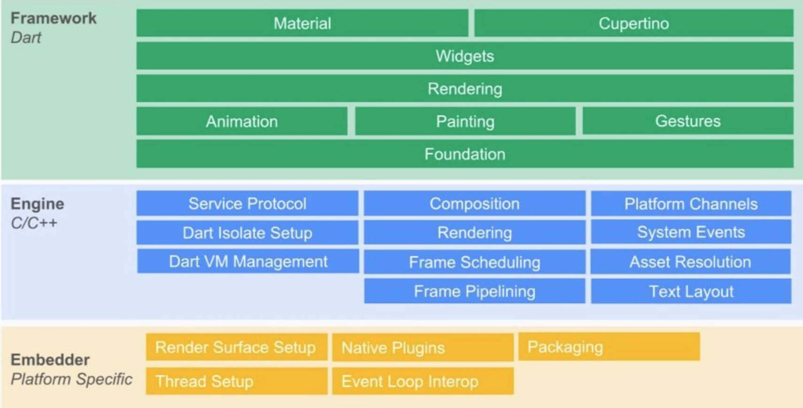

### page 1
为所有屏幕构建精美应用
Flutter 是 Google 开源的应用开发框架，仅通过一套代码库，就能构建精美的、原生平台编译的多平台应用。
整体上介绍移动端近年的发展历程，引出Flutter，从环境搭建开始旅程。

### page 2
谷歌推出的一套跨平台、开源的UI框架，支持IOS、android和前端开发，是未来操作系统Fuchsia的默认开发套件。
于2017年5月发布第一个版本，2018年12月发布1.0稳定版。
Github上与其相关的信息越来越活跃。

### page 3 优势
1、跨平台性：真正做到一套代码可以同时在安卓，ios两大平台(现在增加了web，macos、window和linux等桌面支持)，避免过高的维护成本，节省测试和开发资源。
2、流畅新模式：通过自绘UI和原生系统实现高帧率的流畅UI。摒弃webview比较老的开发方式，使用Skia作为2D渲染引擎，使用Dart语言作为运行时，以及使用Text作为文字排版的引擎。
RN和weex等采用的是javascript与原生交互，并通过js发送布局消息传递给原生端，实现布局渲染的。
3、开发过程中的热重载：开发过程中，只需要保存操作即可刷新项目，提高开发效率。
4、高性能：直接调用系统的API绘制UI，更接近原生。
5、学习成本低：如果有React Native经验，有前端或原生开发经验，学起来都比较省力。

### page 4 架构
造房子前要要有施工图，写代码前要有架构图，依据此，再去实现技术上的需求，以下是官方的架构图。



todo
Framework使用dart实现，包括Material Design风格的Widget，Cupertino(针对iOS)风格的Widgets，文本/图片/按钮等基础Widgets、渲染、动画、手势等。此部分的核心代码是：flutter仓库下的flutter package，以及sky_engine仓库下的io,async,ui(dart:ui库提供了Flutter框架和引擎之间的接口)等package。

Framework由dart语言实现的sdk。
底层UI库：最下两层，提供动画、手势及绘制能力，暴露给开发者使用。
Rendering层：负责构建UI树，每当Element有变化时会计算出变化部分更新UI树，最终将其绘制到屏幕上。
Widgets层：基础组件库，包括Material Design风格的Widget，Cupertino(针对iOS)风格的Widgets。


Engine使用C++实现，主要包括:Skia,Dart和Text。Skia是开源的2D图形库(Android系统自带，ios不自带，所以ios的包所占空间更大)，提供了适用于多种软硬件平台的通用API。其已作为Google Chrome，Chrome OS，Android, Mozilla Firefox, Firefox OS等其他众多产品的图形引擎，支持平台还包括Windows7+,macOS 10.10.5+,iOS8+,Android4.4+,Ubuntu14.04+等。

Dart部分主要包括：Dart Runtime，Garbage Collection(GC)，如果是Debug模式的话，还包括JIT(Just In Time)支持。Release和Profile模式下，是AOT(Ahead Of Time)编译成了原生的arm代码，并不存在JIT部分。Text即文本渲染，其渲染层次如下：衍生自minikin的libtxt库(用于字体选择，分隔行)。HartBuzz用于字形选择和成型。Skia作为渲染/GPU后端，在Android和Fuchsia上使用FreeType渲染，在iOS上使用CoreGraphics来渲染字体。

Embedder是一个嵌入层，即把Flutter嵌入到各个平台上去，这里做的主要工作包括渲染Surface设置,线程设置，以及插件等。从这里可以看出，Flutter的平台相关层很低，平台(如iOS)只是提供一个画布，剩余的所有渲染相关的逻辑都在Flutter内部，这就使得它具有了很好的跨端一致性。

### page 5 开发环境搭建
* 1、mac os
  * 1）下载
  地址：https://flutter.dev/docs/get-started/install/macos
   flutter_macos_1.17.5-stable.zip 
  * 2）解压缩
  * 3）设置环境变量，在.bash_profile中添加如下语句：
  export PATH=$PATH:[your flutter path]/flutter/bin
  * 4）刷新环境变量
  source .bash_profile
  * 5）安装IDE
  Xcode：9.0以上版本，运行ios模拟器
  Android studio：开发，安装dart插件和flutter插件，原生开发用
  VScode：开发，插件同studio一致，前端开发用
  * 6）诊断
  对安装的环境进行检测，稍等片刻会给出结果，如果没问题每条前边都是[√]，有问题的会给出建议，如下：
```
localhost:bin lyl$ flutter doctor
Doctor summary (to see all details, run flutter doctor -v):
[✓] Flutter (Channel stable, v1.17.5, on Mac OS X 10.14.6 18G95, locale
    zh-Hans-CN)
[!] Android toolchain - develop for Android devices (Android SDK version 29.0.3)
    ✗ Android license status unknown.
      Try re-installing or updating your Android SDK Manager.
      See https://developer.android.com/studio/#downloads or visit visit
      https://flutter.dev/docs/get-started/install/macos#android-setup for
      detailed instructions.
[!] Xcode - develop for iOS and macOS (Xcode 11.3)
    ✗ CocoaPods not installed.
        CocoaPods is used to retrieve the iOS and macOS platform side's plugin
        code that responds to your plugin usage on the Dart side.
        Without CocoaPods, plugins will not work on iOS or macOS.
        For more info, see https://flutter.dev/platform-plugins
      To install:
        sudo gem install cocoapods
[!] Android Studio (version 4.0)
    ✗ Flutter plugin not installed; this adds Flutter specific functionality.
    ✗ Dart plugin not installed; this adds Dart specific functionality.
[!] Android Studio (version 3.5)
    ✗ Flutter plugin not installed; this adds Flutter specific functionality.
    ✗ Dart plugin not installed; this adds Dart specific functionality.

[!] Connected device
    ! No devices available

! Doctor found issues in 5 categories.
```
按照建议修复后结果如下：(注：上边是window，下边是mac，这里只是举栗子～～)
```
LYLdeMacBook-Pro:flutter lyl$ flutter doctor
Doctor summary (to see all details, run flutter doctor -v):
[✓] Flutter (Channel stable, 3.0.1, on macOS 12.4 21F79 darwin-x64, locale
    zh-Hans-CN)
[✓] Android toolchain - develop for Android devices (Android SDK version 32.0.0)
[✓] Xcode - develop for iOS and macOS (Xcode 13.4)
[✓] Chrome - develop for the web
[✓] Android Studio (version 2020.3)
[✓] Android Studio (version 2021.1)
[✓] VS Code (version 1.67.2)
[✓] Connected device (3 available)
[✓] HTTP Host Availability

• No issues found!
```

### page 6 channel
```
localhost:bin lyl$ flutter channel
Flutter channels:
  master
  dev
  beta
* stable
```
官方推荐使用stable channel，切换命令flutter channel  [channel name]

### page 7 packages
pubspec.yaml文件掌管着flutter依赖包，类似node.js中的package.json。
查看依赖包列表：flutter packages get
更新依赖包：flutter packages upgrade


### page 8 first demo
todo

