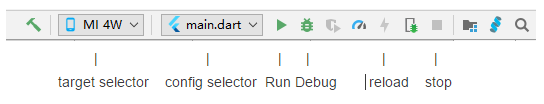
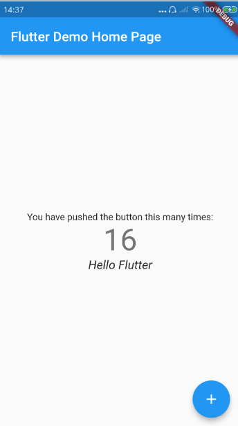

### 1.Create the app
* 1.Select `File > New Flutter Project`.
* 2.Select `Flutter application` as the project type, and press Next.
* 3.Make sure that the `Flutter SDK Path` text field specifies the location of the SDK. Install the SDK if you haven’t yet done so.
* 4.Enter a project name (for example, myapp), and press Next.
* 5.Click `Finish`.
* 6.Wait for Android Studio to install the SDK, and create the project.

The above commands create a Flutter project directory called `myapp` that contains a simple demo app that uses Material Components.

In the project directory, the code for your app is in `lib/main.dart`.

### 2.Run the app

* 1.Locate the main Android Studio toolbar

* 2.In the target selector, select an Android device for running the app

* 3.Click the run icon in the toolbar, or invoke the menu item `Run > Run`.

After the app build completes, you’ll see the starter app on your device

