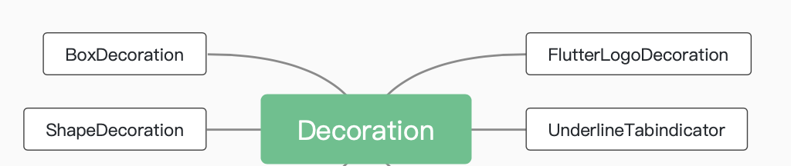

背景装饰对象，等同于`Android`中的`shape`。

* BoxDecoration:
	实现边框、圆角、阴影、形状、渐变、背景图像
* ShapeDecoration:
	实现四个边分别指定颜色和宽度、底部线、矩形边色、圆形边色、体育场（竖向椭圆）、 角形（八边角）边色
* FlutterLogoDecoration:【todo这个改名了，ImageDecoration】
	实现Flutter图片
* UnderlineTabindicator:【todo这个删除了,用其他方式代替】
	下划线
