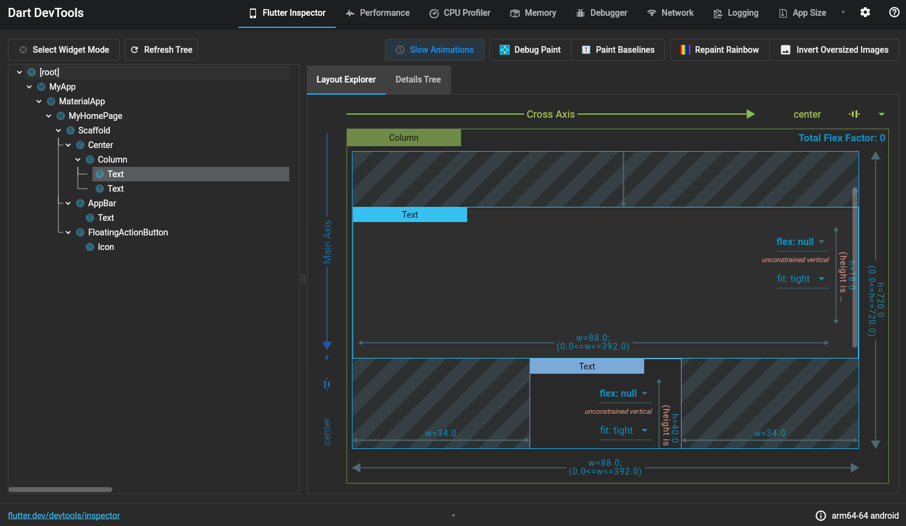

## What is DevTools?

DevTools是Dart和Flutter的一套性能和调试工具。

## DevTools可以做什么？

* 检查Flutter应用的UI布局和状态。
* 在Flutter应用中诊断UI性能问题。
* Flutter或Dart应用程序的CPU配置文件。
* Flutter应用程序的网络分析。
* Flutter或Dart应用程序的源代码级调试。
* 在Flutter或Dart命令行应用程序中调试内存问题。
* 查看有关正在运行的Flutter或Dart命令行应用程序的常规日志和诊断信息。
* 分析代码和应用大小。

希望将DevTools与现有的IDE或基于命令行的开发工作流结合使用。

