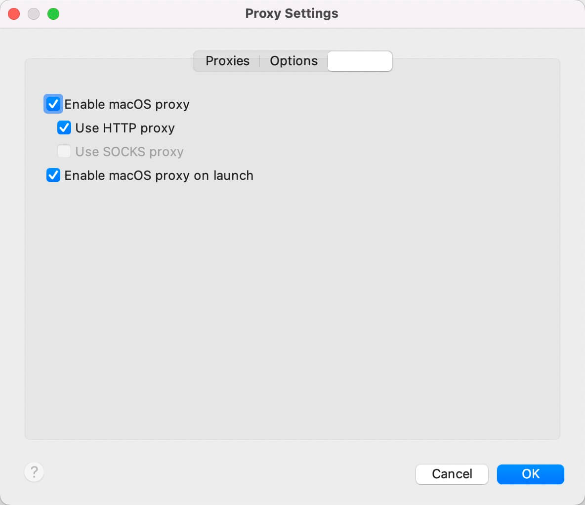
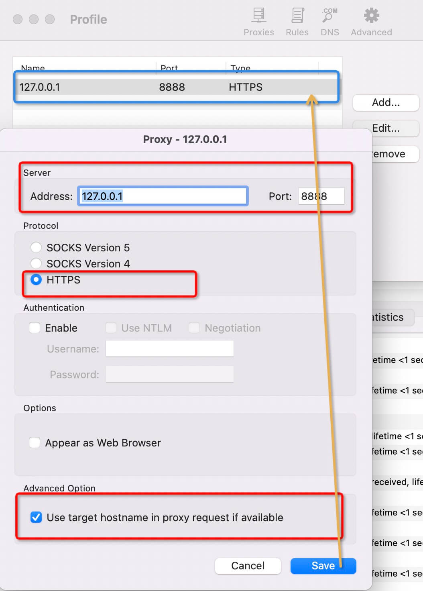
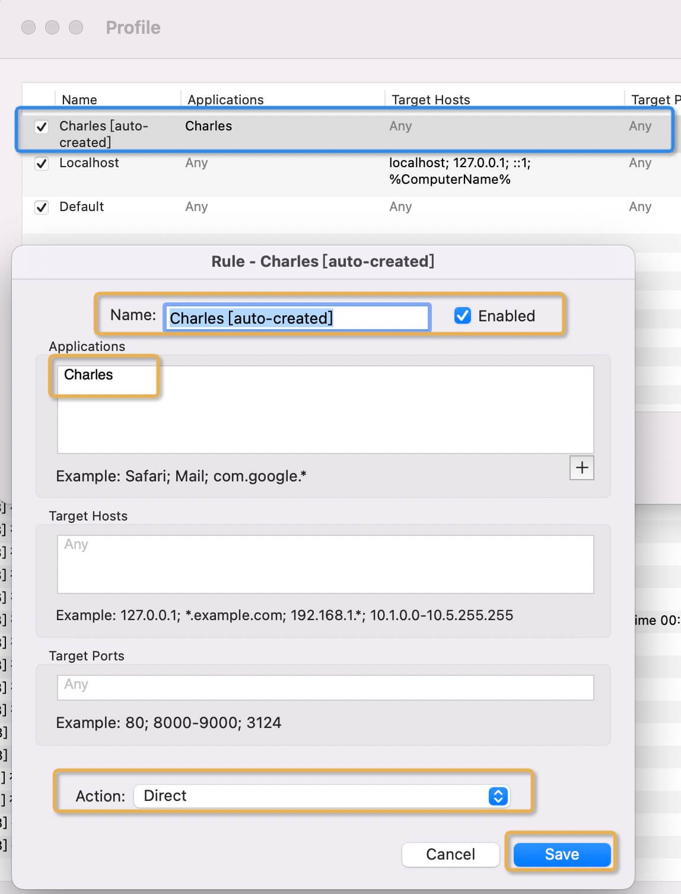

macOS系统下抓包～

## 环境
### macOS Monterey
版本: 12.4
MacBook Pro (13-inch, 2020, Four Thunderbolt 3 ports)
处理器: 2 GHz 四核Intel Core i5
内存: 16 GB 3733 MHz LPDDR4X

### Charles
V4.5.5

### Proxifier
v3.7

## Proxifier
`Proxifier`是一款功能非常强大的`socks5`客户端，可以让不支持通过代理服务器工作的网络程序能通过`HTTPS`或`SOCKS`代理或代理链。
许多网络应用程序不支持通过代理服务器工作，因此不能用于局域网或防火墙后面。这些会损害公司的
隐私和导致很多限制。Proxifier解决了这些问题和所有限制，创建代理隧道，并添加使用更多网络功能的权力

## Charles
`Charles` 是一款常用的网络抓包工具，通过将自己设置成系统的网络访问代理服务器，用于调试与服务器端的网络通讯协议，除了常见的`HTTP`协议的抓包，`Charles` 还可以分析 `HTTPS` 协议。

**Charles的功能包括但不局限如下：**

* 截取 Http 和 Https 网络封包。
* 支持重发网络请求，方便后端调试。
* 支持修改网络请求参数。
* 支持网络请求的截获并动态修改。
* 支持模拟慢速网络。

## (*)配置

### 1、安装
分别安装`Charles`和`Proxifier`.
安装步骤...此处省略一千字......

### 2、配置Charles
#### 2.1 打开macOS proxy
选择`Proxy->macOS Proxy`

#### 2.2 配置Proxy Settings
选择`Proxy->Proxy Settings`

#### 2.3 配置SSL Proxy Settings
选择`Proxy->SSL Proxying Settings`, 这里配置Host为`*`, 端口为`443`或`*`.

### 3、配置proxifier
#### 3.1 添加代理
选择`option->profile->proxy servers`, 点击`Add`添加代理，如图，save后会展示到配置列表中。

#### 3.2 设置代理规则
选择`option->profile->Proxification Rules`, 这一步软件会自动生成，确认下信息即可。

#### 3.3 修改DNS配置
选中`resolve hostnames through proxy.`就是需要通过代理解析。

配置好后在系统/网络下会看到已连接和运行中的状态

至此，基本的配置完成后，就可以用charles进行抓包了～
赶紧搬砖去……时间从手指刷啦啦的划过......

## 疑问
### 1、连了代理后抓到的全部显示`unknown`
排查下这两个设置是否同步: 主要看#3.1和#3.3, 我和同事基本卡在这里耽误了点时间。

