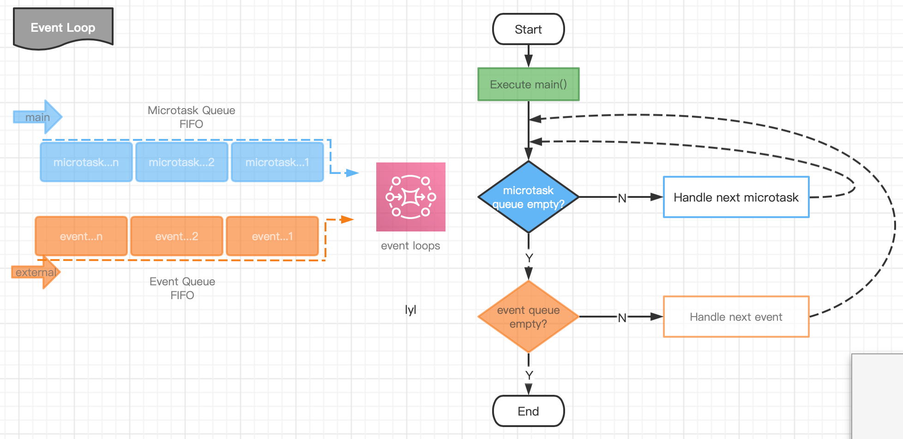

> TODO :

在`Flutter`开发中，执行任务原则同`Android`中的`Handler`，也是依靠事件驱动的。如下图所示，当`main()`执行后就生成了一个`event loop`事件循环，通过`event loop`不停的从事件队列中获取消息来执行程序中所有任务。事件消息包括微任务队列(microtask)和事件队列(event queue)，其中`microtask`的优先级高于`event queue`，也就是说`event loop`每执行完成一次后，都会再次查询事件队列中是否存在`microtask`任务，如果存在则优先执行，直到队列中不再存在`microtask`任务才会执行`event queue`任务。根据此特性在程序中对一个优先级高的任务可做事件插队。

<div align="center">

</div>


代码验证，如图：


```
void main(){
  ReceivePort receivePort = ReceivePort();

  receivePort.listen((message) {
    print(message);
  });

  Future.microtask((){
    print("microtask-1");
  });

  receivePort.sendPort.send("给event queue队列的消息-1");

  Future.microtask((){
    print("microtask-2");
  });

  receivePort.sendPort.send("给event queue队列的消息-2");

}
```