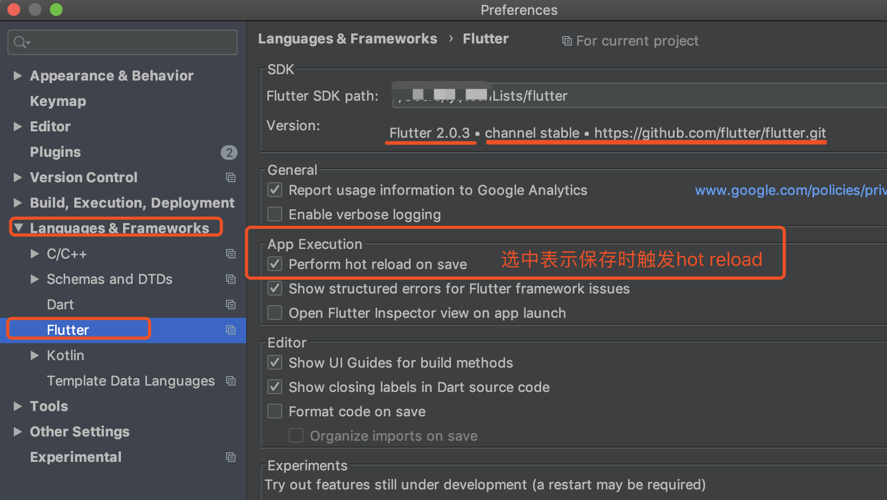
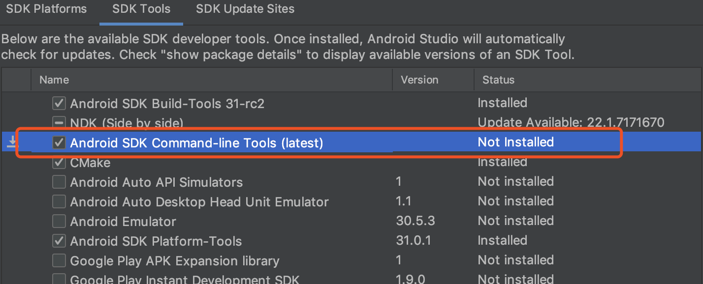

### 11、[windows]Flutter: Building with plugins requires symlink support
```
Building with plugins requires symlink support.

Please enable Developer Mode in your system settings. Run
  start ms-settings:developers
to open settings.
exit code 1
```
[solution] 
* 1、open settings.(window or command `start ms-settings:developers`)
* 2、Click on `Privacy & Security` and after, click on for developers option.
* 3、On for developers settings, activate the Developer mode option (Install apps from any source...).


### 10、新增package(desktop_webview_window)，运行时报错：CocoaPods could not find compatible versions for pod "desktop_webview_window":

```
Launching lib/main.dart on macOS in debug mode...
CocoaPods' output:
↳
      Preparing
    Analyzing dependencies
    Inspecting targets to integrate
      Using `ARCHS` setting to build architectures of target `Pods-Runner`: (``)
    Finding Podfile changes
      A desktop_webview_window
      - FlutterMacOS
      - package_info_plus_macos
      - screen_retriever
      - window_manager
    Fetching external sources
    -> Fetching podspec for `FlutterMacOS` from `Flutter/ephemeral`
    -> Fetching podspec for `desktop_webview_window` from `Flutter/ephemeral/.symlinks/plugins/desktop_webview_window/macos`
    -> Fetching podspec for `package_info_plus_macos` from `Flutter/ephemeral/.symlinks/plugins/package_info_plus_macos/macos`
    -> Fetching podspec for `screen_retriever` from `Flutter/ephemeral/.symlinks/plugins/screen_retriever/macos`
    -> Fetching podspec for `window_manager` from `Flutter/ephemeral/.symlinks/plugins/window_manager/macos`
    Resolving dependencies of `Podfile`
      CDN: trunk Relative path: CocoaPods-version.yml exists! Returning local because checking is only performed in repo update
    [!] CocoaPods could not find compatible versions for pod "desktop_webview_window":
      In Podfile:
        desktop_webview_window (from `Flutter/ephemeral/.symlinks/plugins/desktop_webview_window/macos`)
    Specs satisfying the `desktop_webview_window (from `Flutter/ephemeral/.symlinks/plugins/desktop_webview_window/macos`)` dependency were found, but they required a higher minimum deployment target.
    /Library/Ruby/Gems/2.6.0/gems/molinillo-0.8.0/lib/molinillo/resolution.rb:317:in `raise_error_unless_state'
    /Library/Ruby/Gems/2.6.0/gems/molinillo-0.8.0/lib/molinillo/resolution.rb:299:in `block in unwind_for_conflict'
    /Library/Ruby/Gems/2.6.0/gems/molinillo-0.8.0/lib/molinillo/resolution.rb:297:in `tap'
    /Library/Ruby/Gems/2.6.0/gems/molinillo-0.8.0/lib/molinillo/resolution.rb:297:in `unwind_for_conflict'
    /Library/Ruby/Gems/2.6.0/gems/molinillo-0.8.0/lib/molinillo/resolution.rb:682:in `attempt_to_activate'
    /Library/Ruby/Gems/2.6.0/gems/molinillo-0.8.0/lib/molinillo/resolution.rb:254:in `process_topmost_state'
    /Library/Ruby/Gems/2.6.0/gems/molinillo-0.8.0/lib/molinillo/resolution.rb:182:in `resolve'
    /Library/Ruby/Gems/2.6.0/gems/molinillo-0.8.0/lib/molinillo/resolver.rb:43:in `resolve'
    /Library/Ruby/Gems/2.6.0/gems/cocoapods-1.11.3/lib/cocoapods/resolver.rb:94:in `resolve'
    /Library/Ruby/Gems/2.6.0/gems/cocoapods-1.11.3/lib/cocoapods/installer/analyzer.rb:1078:in `block in resolve_dependencies'
    /Library/Ruby/Gems/2.6.0/gems/cocoapods-1.11.3/lib/cocoapods/user_interface.rb:64:in `section'
    /Library/Ruby/Gems/2.6.0/gems/cocoapods-1.11.3/lib/cocoapods/installer/analyzer.rb:1076:in `resolve_dependencies'
    /Library/Ruby/Gems/2.6.0/gems/cocoapods-1.11.3/lib/cocoapods/installer/analyzer.rb:124:in `analyze'
    /Library/Ruby/Gems/2.6.0/gems/cocoapods-1.11.3/lib/cocoapods/installer.rb:416:in `analyze'
    /Library/Ruby/Gems/2.6.0/gems/cocoapods-1.11.3/lib/cocoapods/installer.rb:241:in `block in resolve_dependencies'
    /Library/Ruby/Gems/2.6.0/gems/cocoapods-1.11.3/lib/cocoapods/user_interface.rb:64:in `section'
    /Library/Ruby/Gems/2.6.0/gems/cocoapods-1.11.3/lib/cocoapods/installer.rb:240:in `resolve_dependencies'
    /Library/Ruby/Gems/2.6.0/gems/cocoapods-1.11.3/lib/cocoapods/installer.rb:161:in `install!'
    /Library/Ruby/Gems/2.6.0/gems/cocoapods-1.11.3/lib/cocoapods/command/install.rb:52:in `run'
    /Library/Ruby/Gems/2.6.0/gems/claide-1.1.0/lib/claide/command.rb:334:in `run'
    /Library/Ruby/Gems/2.6.0/gems/cocoapods-1.11.3/lib/cocoapods/command.rb:52:in `run'
    /Library/Ruby/Gems/2.6.0/gems/cocoapods-1.11.3/bin/pod:55:in `<top (required)>'
    /usr/local/bin/pod:23:in `load'
    /usr/local/bin/pod:23:in `<main>'
Error output from CocoaPods:
↳
    /System/Library/Frameworks/Ruby.framework/Versions/2.6/usr/lib/ruby/2.6.0/universal-darwin21/rbconfig.rb:230: warning: Insecure world writable dir /Users/lyl/techWorks in PATH, mode 040777
Exception: Error running pod install
Exited

```
[solution] 
/macos/Podfile中修改下deployment Target，`platform :osx, '10.12'`

### 9、编译时报错：The sandbox is not in sync with the Podfile.lock. Run 'pod install' or update your CocoaPods installation.

[solution] 
```
1、$ cd macos/ 【or ios/】
2、$ pod install
3、然后运行工程即可
```

### 8、clone项目时报错 fatal: unable to access : error:1407742E:SSL routines:SSL23_GET_SERVER_HELLO:tlsv1 alert protocol version

[solution] window下将git的安装路径从E:\Program Files (x86)\Git移到E:\Program Files\Git，再次运行clone即可。

### 7、CocoaPods not installed or not in valid state
```
Launching lib/main.dart on macOS in debug mode... lib/main.dart:1
Warning: CocoaPods not installed. Skipping pod install.
  CocoaPods is used to retrieve the iOS and macOS platform side's plugin code that responds to your plugin usage on the Dart side.
  Without CocoaPods, plugins will not work on iOS or macOS.
  For more info, see https://flutter.dev/platform-plugins
To install see https://guides.cocoapods.org/using/getting-started.html#installation for instructions.

Exception: CocoaPods not installed or not in valid state.
Exited
```
运行一个demo，出现以上错误，是因为本地没安装「CocoaPods，iOS 和 OS X下的一个第三方库管理工具，类似的iOS工具还有Carthage（比较轻量级，需要手动配置，非侵入式），与Java里的Maven也比较类似，但是没有maven的构建、运行程序、打包等功能，仅是库依赖配置和库版本管理工具」，执行命令安装就可以了，这里需要输入电脑密码。


```
LYLdeMacBook-Pro:ios lyl$ sudo gem install cocoapods
```
出现这个的结果即成功，
```
Successfully installed cocoapods-deintegrate-1.0.5
Successfully installed cocoapods-downloader-1.6.3
Successfully installed cocoapods-plugins-1.0.0
Successfully installed cocoapods-search-1.0.1
Successfully installed cocoapods-trunk-1.6.0
Successfully installed cocoapods-try-1.2.0
Successfully installed molinillo-0.8.0
Successfully installed atomos-0.1.3
Successfully installed colored2-3.1.2
Successfully installed nanaimo-0.3.0
Successfully installed rexml-3.2.5
Successfully installed xcodeproj-1.21.0
Successfully installed escape-0.0.4
Successfully installed fourflusher-2.3.1
Successfully installed gh_inspector-1.1.3
Successfully installed ruby-macho-2.5.1
Successfully installed cocoapods-1.11.3
......
Done installing documentation for concurrent-ruby, i18n, tzinfo, zeitwerk, activesupport, nap, fuzzy_match, httpclient, algoliasearch, ffi, ethon, typhoeus, netrc, public_suffix, addressable, cocoapods-core, claide, cocoapods-deintegrate, cocoapods-downloader, cocoapods-plugins, cocoapods-search, cocoapods-trunk, cocoapods-try, molinillo, atomos, colored2, nanaimo, rexml, xcodeproj, escape, fourflusher, gh_inspector, ruby-macho, cocoapods after 48 seconds
34 gems installed
```
安装完查看下pod版本
```
LYLdeMacBook-Pro:ios lyl$ pod --version
/System/Library/Frameworks/Ruby.framework/Versions/2.6/usr/lib/ruby/2.6.0/universal-darwin21/rbconfig.rb:230: warning: Insecure world writable dir /Users/lyl/techWorks in PATH, mode 040777

1.11.3
```

如果安装后报以下错误,
```
ERROR:  Error installing cocoapods: 	
ERROR: Failed to build gem native extension.
```
安装cocoapods时指定个低版本就可以解决。要么就升级ruby，我选择直接安装低版本后成功。
```
sudo gem install cocoapods -v [版本号]
```


### 6、编译失败[190716]
愉快的编写着flutter code，下午突然不能编译了，出现如下错误：
```
Resolving dependencies...
Running Gradle task 'assembleDebug'...
D8: Program type already present: android.support.v4.os.ResultReceiver$1

FAILURE: Build failed with an exception.

* What went wrong:
Execution failed for task ':app:transformDexArchiveWithExternalLibsDexMergerForDebug'.
> com.android.builder.dexing.DexArchiveMergerException: Error while merging dex archives:
D:\techworkspace\flutter\flutterCombat\flutter_combat\build\app\intermediates\transforms\dexBuilder\debug\0.jar,
D:\techworkspace\flutter\flutterCombat\flutter_combat\build\app\intermediates\transforms\dexBuilder\debug\1.jar, 
D:\techworkspace\flutter\f...
...
...
  Program type already present: android.support.v4.os.ResultReceiver$1
  Learn how to resolve the issue at https://developer.android.com/studio/build/dependencies#duplicate_classes.

* Try:
Run with --stacktrace option to get the stack trace. 
Run with --info or --debug option to get more log output. Run with --scan to get full insights.

* Get more help at https://help.gradle.org

BUILD FAILED in 14s
*******************************************************************************************
The Gradle failure may have been because of AndroidX incompatibilities in this Flutter app.
See https://goo.gl/CP92wY for more information on the problem and how to fix it.
*******************************************************************************************
Finished with error: Gradle task assembleDebug failed with exit code 1
```

大概意思是说，安卓依赖在编译时和运行时出现了不同的版本，因为有了AndroidX的出现。

可能在你使用的依赖package的时候，你会注意到他们的更新日志，其中会有Migrate to AndroidX。
由于之前的Android.support包管理过于混乱，所以Google推出了AndroidX。如果各位开发者有时间的话，还是要尽量升级一下项目到AndroidX，毕竟这个是未来，谷歌的新标准。

**使用Android Studio自动升级
确保AS是3.2以上，**

* 1.打开project，在android文件夹上右键选择->Flutter->Open Android Module in Android Studio
* 2.自动打开了一个新窗口，等待tasks执行完毕，选择Refactor->Migrate to AndroidX.
* 3.检测完成后，下方出现提示徐亚升级的地方，确认后点击Do Refector

升级完毕，关闭窗口，再次运行Flutter即可。


### 5、`Waiting for another flutter command to release the startup lock...`
想看下当前版本，执行命令时提示了以上信息，what?why?how?  
G了下，大概了解了原因，是因为项目异常关闭、IDE(如android studio等)异常终止(如任务管理器或活动监视器强制关闭)，然后下次运行时候会提示一个⚠️警告。  

有两种办法解决该问题，就是将`lockfile`文件删除，该文件为0字节，当执行一些命令时还是会出现一个0字节的`lockfile`文件。  
① go to `[flutter directory]/bin/cache/` and `delete this lockfile`.  
② executive command `rm ./flutter/bin/cache/lockfile`.  

**maybe?**
`killall -9 dart` or  `flutter clean`

### 4、保存时执行hot reload


### 3、flutter doctor检查出现的问题
```cmd
$ flutter doctor
[!] Android toolchain - develop for Android devices (Android SDK version 29.0.3)
    X Android license status unknown.
      Try re-installing or updating your Android SDK Manager.
      See https://developer.android.com/studio/#downloads or visit https://flutter.dev/setup/#android-setup
      for detailed instructions.
```

Solution：
在Android Studio中启动SDK Manager；
去掉选项Hide Obsolete Packages；
选择安装Android SDK Tools (Obsolete)；
点击Apply；
安装完成；

然后运行` $ flutter doctor --android-licenses`，一直输入y即可。
Android SDK Tools被废弃了 但Flutter还需要其提供支持。

如果运行`--android-licenses`命令报错(并且在运行app时一直显示白屏后无反应)如下：
```
lyldeMacBook-Pro:flutter lyl$ flutter doctor --android-licenses
Exception in thread "main" java.lang.NoClassDefFoundError: javax/xml/bind/annotation/XmlSchema
	at com.android.repository.api.SchemaModule$SchemaModuleVersion.<init>(SchemaModule.java:156)
	at com.android.repository.api.SchemaModule.<init>(SchemaModule.java:75)
	at com.android.sdklib.repository.AndroidSdkHandler.<clinit>(AndroidSdkHandler.java:81)
	at com.android.sdklib.tool.sdkmanager.SdkManagerCli.main(SdkManagerCli.java:73)
	at com.android.sdklib.tool.sdkmanager.SdkManagerCli.main(SdkManagerCli.java:48)
Caused by: java.lang.ClassNotFoundException: javax.xml.bind.annotation.XmlSchema
	at java.base/jdk.internal.loader.BuiltinClassLoader.loadClass(BuiltinClassLoader.java:602)
	at java.base/jdk.internal.loader.ClassLoaders$AppClassLoader.loadClass(ClassLoaders.java:178)
	at java.base/java.lang.ClassLoader.loadClass(ClassLoader.java:521)
	... 5 more
```

Solution: 打开android studio SDK Manager，选中cmd-line进行安装，完成后重启IDE `Invalidate caches/Restart`再次Run




### 2、Could not resolve io.flutter:flutter_embedding_debug
Solution: 
```
 // 添加 
 maven { url “http://download.flutter.io”}
（maven { url "https://storage.googleapis.com/download.flutter.io" }）

allprojects {
    repositories {
        google()
        jcenter()
        maven { url "http://download.flutter.io"}
    }
}
```

### 1、helloWorld第一步出现的错误（参考第三步Android license status unknown）
编译慢。
```
Android license status unknown.
Try re-installing or updating your Android SDK Manager.
```

Solution: sdk tools（/Users/lyl/Library/Android/sdk/tools/bin/sdkmanager）已经是废弃状态了，但flutter还是在支持中。


